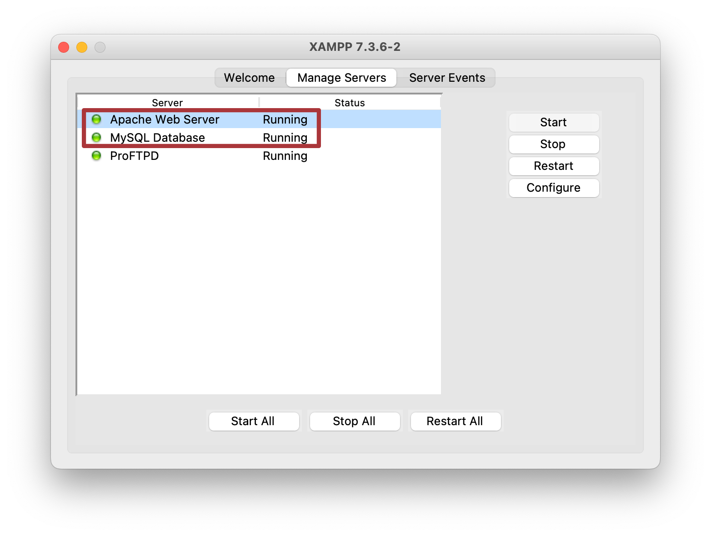
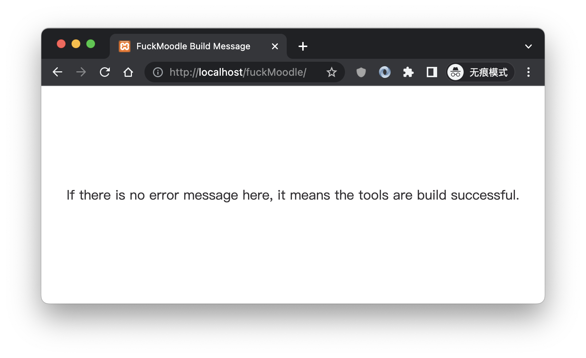
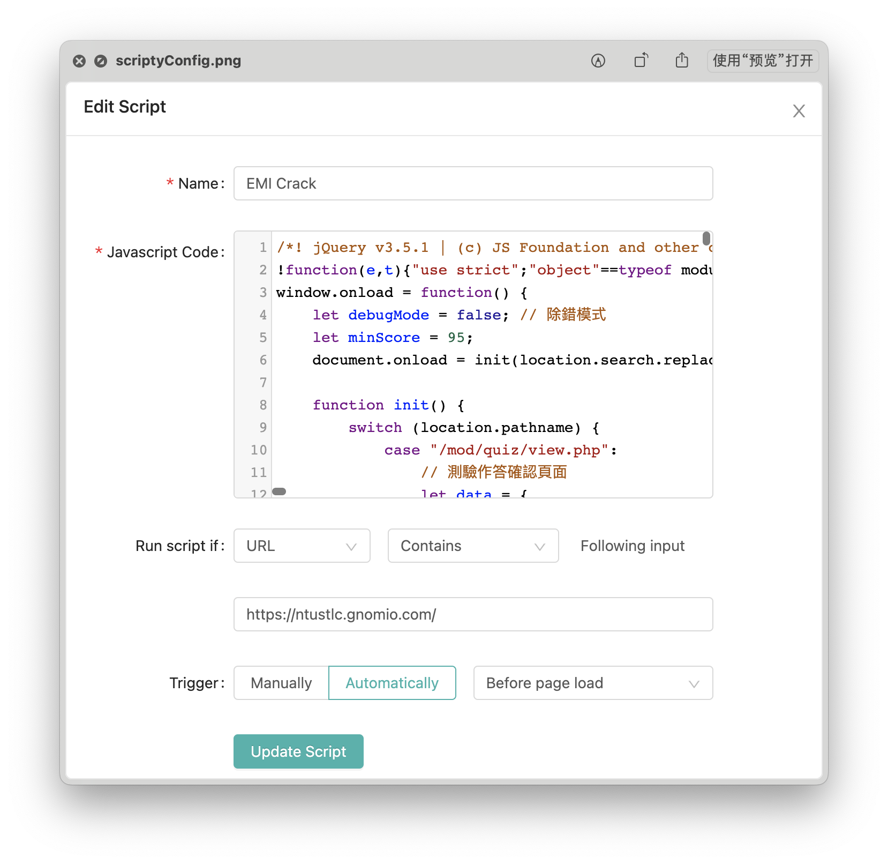

# 台科大英語自學點數剋星
全自動操作、為您省下大把時間，還可以開出多個視窗同時作答。


[Demo影片連結](https://www.youtube.com/watch?v=NDjQtxoEI9c)

----
你是否為這學期的英語自學點數感到困擾，覺得題目好難？怎麼那麼擊敗？明明就同一份試卷，每次出來的題目順序不一樣就算了，有時連選項都不一樣...一頁一題的試卷類型是否也讓你感到頗崩潰？快試試這個，讓您的英語自學點數任務扶搖直上九萬里！

###你得先安裝以下軟件與插件

XAMPP(7.3.6, 包含 Apache Server, MySQL) [Windows](https://sourceforge.net/projects/xampp/files/XAMPP%20Windows/7.3.6/xampp-windows-x64-7.3.6-4-VC15-installer.exe/download)  |  [macOS](https://sourceforge.net/projects/xampp/files/XAMPP%20Mac%20OS%20X/7.3.6/xampp-osx-7.3.6-4-installer.dmg/download)

Scripty (Chrome 插件) [安裝連結](https://chrome.google.com/webstore/detail/scripty-javascript-inject/milkbiaeapddfnpenedfgbfdacpbcbam?utm_source=chrome-ntp-icon)

### 安裝教學

1. 去裝上面寫到的兩個東西
2. 把我這個專案檔案丟到下面的資料夾，並且把資料夾重新命名為「fuckMoodle」
   ```
   macOS: /Applications/XAMPP/xamppfiles/htdocs
   Windows: C:\xampp\htdocs
   ```
3. 到 "启动台" 把XAMPP打開，要你輸入密碼你就輸入
4. 切到Manage Servers把Apache Web Server跟MySQL Database打開(start)
   
5. 打開瀏覽器，輸入：`http://localhost/phpmyadmin` 進入資料庫管理頁面
6. 新建一個名稱叫"fuck_moodle"的資料庫，編碼類型請選「utf8mb4_unicode_ci」
7. 將`fuck_moodle.sql`匯入到剛剛創建的資料庫
8. 在網址列輸入`http://localhost/fuckMoodle` ，如果你看到以下的畫面且沒有其他錯誤就表示API佈建完成。
   
9. 到Scripty裡面新增一個Script
    1. Name: 隨便亂打
    2. Javascript Code: 到本專案的js資料夾中找到檔案`fuckMoodle_withBackend.js`，用文本編輯器將它打開複製起來貼到這裡。
    3. Run script if: [URL] [Contains] Following input
    4. 在輸入欄位中輸入這個`https://ntustlc.gnomio.com/`
    5. Trigger: Manually
    
10. 打開 https://ntustlc.gnomio.com/ ，進入你要完成的課程，打開該課程的「成績」，開到作答頁面程式就會自動執行了。