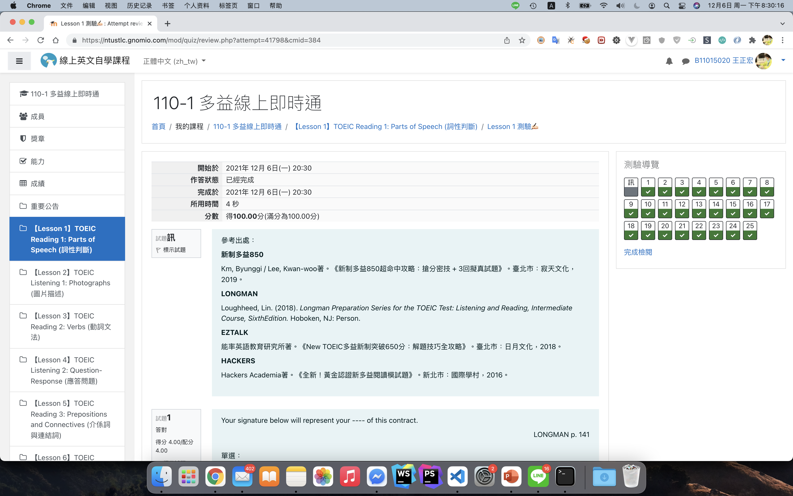

## 台科大英語自學點數剋星
>全自動操作、為您省下大把時間，還可以開出多個同時作答。

### Demo 影片

你是否為這學期的英語自學點數感到困擾，覺得題目好難？怎麼那麼擊敗？明明就同一份試卷，每次出來的題目順序不一樣就算了，有時連選項都不一樣...一頁一題的試卷類型是否也讓你感到頗崩潰？快試試這個，讓您的英語自學點數任務扶搖直上九萬里！

`你得先安裝以下軟件與插件`

XAMPP(7.3.6, 包含 Apache Server, MySQL) [Windows](https://sourceforge.net/projects/xampp/files/XAMPP%20Windows/7.3.6/xampp-windows-x64-7.3.6-4-VC15-installer.exe/download)  |  [macOS](https://sourceforge.net/projects/xampp/files/XAMPP%20Mac%20OS%20X/7.3.6/xampp-osx-7.3.6-4-installer.dmg/download)

Scripty (Chrome 插件) [安裝連結](https://chrome.google.com/webstore/detail/scripty-javascript-inject/milkbiaeapddfnpenedfgbfdacpbcbam?utm_source=chrome-ntp-icon)

CORS Unblock（Chrome 插件）[安裝連結](https://chrome.google.com/webstore/detail/cors-unblock/lfhmikememgdcahcdlaciloancbhjino?utm_source=chrome-ntp-icon)
